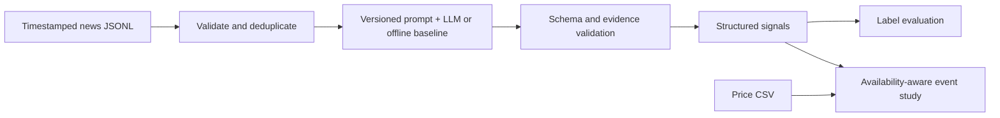

# AI Market Signal Agent

**Can structured news interpretation be evaluated as a market research signal?**

A compact Python research pipeline turns ticker-specific news into validated JSON,
compares sentiment/event extraction, and measures subsequent returns over 1, 5,
and 20 observed trading sessions. The goal is to test an extraction workflow and
research hypothesis, not to have an LLM predict prices directly.

**Status:** complete offline demonstration plus an optional live LLM adapter.
Bundled results use **synthetic news/prices and a keyword baseline**, not an LLM.
This repository does not demonstrate predictive alpha. It is a bounded pipeline
sometimes called an “agent”; it has no autonomous order execution or tool loop.

## Why this is AI × Finance

- Structured output: sentiment, event, confidence, expected horizon, quoted evidence, reason.
- Research layer: availability-aware entry timing and 1d/5d/20d forward returns.
- LLMOps: explicit prompts, schema/evidence checks, content-addressed cache,
  provider/model attribution, latency/token metadata, logs, and bounded retries.
- Evaluation: sentiment accuracy/macro F1, event accuracy, confusion matrix,
  failure examples, acceptance rate, and version comparison.



## Setup and run

Python 3.11+ recommended. From this repository directory:

```bash
python -m venv .venv
# Windows PowerShell:
.venv\Scripts\Activate.ps1
# macOS/Linux: source .venv/bin/activate
python -m pip install -r requirements.txt
python demo/run_demo.py
python -m unittest discover -s tests -v
```

If PowerShell blocks activation, use `.venv\Scripts\python.exe` in place of
`python`; changing the execution policy is unnecessary. The demo runs entirely
offline. View `runs/demo/`, or inspect the committed `evaluation/sample_run/`.
Open `demo/report.html` for a static preview of the bundled run (it does not
refresh automatically when inputs change).

### Real LLM mode (optional; requires an API account)

```powershell
python -m pip install -r requirements-live.txt
$env:OPENAI_API_KEY = "YOUR_KEY"
$env:OPENAI_MODEL = "YOUR_SUPPORTED_STRUCTURED_OUTPUT_MODEL"
python -m src.main --provider openai --out runs/live
```

Choose an available model supporting Responses structured outputs in your account.
No model availability or price is assumed. The key is read from the environment;
`.env.example` is documentation and is not loaded automatically. Never commit a key.
In live mode, supplied article text or portfolio metrics are sent to OpenAI.
The application requests `store=False`; account-level retention rules still apply.
Live errors are visible; the app never silently substitutes an offline result.
Live API calls were **not executed** in the delivered sample run.

The adapter follows [OpenAI's structured outputs guide](https://developers.openai.com/api/docs/guides/structured-outputs).
It uses Pydantic validation with `responses.parse`, validates parsed responses,
and handles refusals/incomplete outputs as failures. Schema compliance does not
establish factual correctness. SDK and account compatibility must be verified
when enabling live mode.

## Repository map

```text
src/                   Small Python modules, including CLI entry point
prompts/               Versioned, reviewable prompts
demo/                  Offline runner and static sample report
data/sample/           Clearly labeled synthetic inputs
evaluation/            Methodology and saved run artifacts
tests/                 Financial correctness and failure-boundary tests
requirements.txt       Offline dependencies
requirements-live.txt  Optional OpenAI SDK
.github/workflows/     Offline CI configuration
```

## AI assistance and ownership

This submission starter was developed with substantial AI coding assistance.
The applicant should run it, review the formulas, inspect failure cases, make
and explain a personal change, and record those steps in `OWNERSHIP.md` before
submitting. Do not claim independent authorship, a live experiment, or profitable
trading results that have not occurred. The interview value is in the research
question, validation, and decisions you can defend.

## Walk through the code

Read `signals.py` → `backtest.py` → `evaluate.py` → `llm.py` → `main.py`.
All are under `src/`. Prices and evaluation labels never enter the LLM payload.
Input news is sorted by availability and exact normalized text is deduplicated
per ticker, keeping the earliest available occurrence; near-duplicates need an additional policy.

### Signal contract

`sentiment ∈ [-1,1]`; `event ∈ {Earnings, Guidance, Regulation, Product, Macro, Other}`;
`confidence ∈ [0,1]`; `expected_horizon ∈ {1d,5d,20d}`. Evidence must be an exact
nonempty substring of the normalized input. Ticker/id come from the input, not the model.
A score above 0.2 is bullish, below -0.2 bearish, otherwise neutral. Confidence
below 0.6 forces abstention. These are fixed illustrative rules, not tuned optimal
parameters. Confidence is subjective and is not a probability of profit.
The expected horizon is saved as an annotation; all three horizons are evaluated
regardless of the annotation to avoid selectively reporting favorable horizons.

### Timing and return definitions

`available_at` must be at or after publication and should reflect actual ingestion
time. Add five minutes for processing, then use the first observed close strictly
later than that timestamp. This is a conservative close-to-close research convention,
not proof of a market-on-close fill. A session is an observed ticker price row;
validate the calendar before using real data. An after-close article enters at a
later close. Missing future endpoints are `right_censored`, never zero returns.

For horizon h: `r_h = close[t+h] / close[t] - 1`.
`signed_net_return = position × r_h − |position| × round_trip_cost_bps / 10000`.
The default illustrative round-trip cost is 10 bps. SPY excess return is asset
return minus SPY return over the exact endpoints; it is **not** signed or cost-adjusted.
The summary's always-long comparator is gross and uses all valid events; active
signal means use a selected subset. These are descriptive benchmarks, not an
apples-to-apples strategy contest.

The backtest is an **event study**: simultaneous/overlapping events are not combined
into a portfolio. Do not annualize these means or call them a Sharpe ratio/CAGR.
Short borrow fees, financing, impact, execution delay and capital constraints are
not modeled. Correlated/overlapping events make naive significance tests invalid;
no p-values or proof of alpha are reported.

## Evaluation and reproducibility

Run `python -m src.main --out runs/recheck` to compare both versions.
See `evaluation/README.md` and `evaluation/sample_run/` for actual results.
Offline v1/v2 are two keyword rules inspired by the prompts; their difference
is **not measured LLM prompt improvement**. Live mode evaluates the actual prompt
files against the same news and labels. Freeze a model snapshot when available.
The 24 authored examples have illustrative chronological dev/test tags. Their
authors knew the cases; this is not an independently held-out benchmark.

Custom data: `python -m src.main --news YOUR_NEWS.jsonl --prices YOUR_PRICES.csv --labels YOUR_LABELS.json --out runs/custom`.
Use `--labels ""` to skip label evaluation. News requires id, ticker, text,
published_at, available_at, source; timestamps must include UTC offsets.
Label JSON is a list of id, direction, event and optional split (dev/test).
Supply SPY prices for excess-return comparisons. A missing benchmark yields null
excess returns, not invented values. There is no built-in news scraping service.

Cache hashes include the full prompt, payload, schema, provider, model, and adapter
version. Logs avoid API keys and full article bodies. `operations.json` records
attempts, latency, usage on fresh calls, and cache-hit flags; cached reads do not
represent new model token usage. Invalid evidence is rejected even on cache reads.
API connection/rate-limit/server failures retry at most three total attempts;
authentication, schema/refusal, and other nontransient failures are not retried.

## Limits and next experiment

Current limitations include tiny synthetic samples, subjective labels, price/news
availability, survivorship bias, historical facts memorized by modern LLMs,
changing model behavior, multiple testing, and publication/selection bias.
With real data, missing sessions can distort horizons; inspect vendor calendars.
Avoid claiming that extraction accuracy proves profitable predictions.

Next: annotate a fresh licensed real-news set independently, freeze prompts and
thresholds on development data, evaluate on a later untouched interval, compare
against the same keyword baseline and a no-trade reference, and record null results.
A forward-collected paper study reduces the risk of model memory of historical events.

## Delivered verification

The offline demo and ten tests passed under Python 3.12.14. See
`evaluation/test-results.txt` and `evaluation/tested-environment.txt`.
`requirements-tested.txt` pins the exact direct dependency versions used;
`requirements.txt` gives supported major-version bounds. This is not a full
transitive lockfile. Live adapter tests use mocks, not real network calls.
